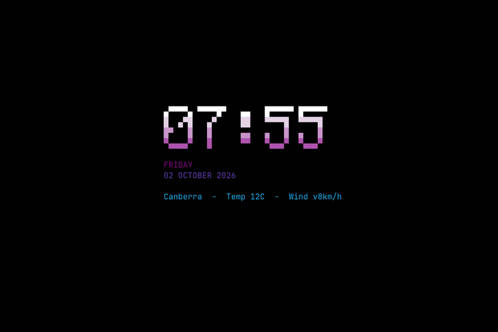

# cadence

A rotating, live ASCII display for [Omarchy](https://omarchy.dev).

Omarchy's screensaver animates one static text file — `branding/screensaver.txt`
— with a random [ttfx](https://github.com/ntno/terminaltexteffects) effect. That
is a fine default, but it is one file forever. Cadence is a fork that rotates
through a **slide list** instead: static art, images, live data, agent status and
desktop notifications, each with its own dwell time.

Everything is user config only. Nothing in `/usr/share/omarchy` is modified, and
your existing screensaver keeps working.

## Why it is not called `omarchy-screensaver`

`/usr/share/omarchy/bin` is **first** in `PATH`; `~/.local/bin` is much later. A
drop-in `~/.local/bin/omarchy-screensaver` therefore could never shadow
Omarchy's own command, and `omarchy-launch-screensaver` would keep launching
upstream. Cadence ships as a separate command instead, alongside the original.

## Demo



## Install

```bash
git clone https://github.com/matthewhand/omarchy-cadence
cd omarchy-cadence
./install.sh --with-watcher
```

`--with-watcher` is optional and only adds desktop notification slides. Nothing
needs `sudo`.

Requires `ttfx`, `jq`, `hyprctl` and `omarchy-transcode-ascii` (all present on a
normal Omarchy install). ImageMagick is optional, used by `helpers/wordfont.py`
workflows to render banners.

## Use

```bash
omarchy-launch-cadence          # full screen, every monitor
omarchy-cadence --dump          # print every slide's art and exit
```

Any key or click exits and restores the cursor. A suggested Hyprland bind:

```lua
o.bind("SUPER + SHIFT + C", "Cadence screensaver", "omarchy-launch-cadence")
```

## Slides

`~/.config/omarchy/screensaver/slides`, one entry per line:

| Directive | Meaning |
|---|---|
| `text PATH` | ASCII art file, used as is |
| `image PATH [MODE]` | PNG or SVG transcoded by `omarchy-transcode-ascii`, cached by mtime. `MODE` is `block` or `braille` |
| `images DIR [MODE]` | every image in `DIR`, in name order, as its own slide |
| `exec COMMAND` | stdout becomes the art, re-run every rotation |
| `notify` | newest queued desktop notification, kept for `notify_cycles` rotations |
| `set KEY=VALUE` | `interval`, `mode`, `width`, `height`, `effects`, `notify_cycles` |

Missing or exhausted slides are skipped rather than left blank, so a missing
image or an empty notification queue will not break the show.

`images` watches the directory: drop a new file in and it joins the rotation
within about 20 seconds, with no restart. Your folder is never written to --
every transcode lands in `~/.cache/omarchy/cadence/`, keyed by source path,
mtime and mode, so an unchanged image is transcoded once and then reused.

```conf
set interval=20
set notify_cycles=6

text ~/.config/omarchy/branding/screensaver.txt
images ~/Pictures/cadence-slides braille
exec python3 ~/.config/omarchy/screensaver/stats-slide.py
exec python3 ~/.config/omarchy/screensaver/herdr-slide.py
notify
```

### Per-slide colour

`ttfx` chooses its effect and gradient **when it starts** and cannot change them
mid-run, so a slide that wants a particular colour has to be started with that
colour. An `exec` slide can write `ttfx` arguments to `$CADENCE_FLAGS`:

```bash
#!/bin/bash
echo "SOME ART"
printf '%s' "--final-gradient-stops FFF75D FE650D E4002B" > "$CADENCE_FLAGS"
```

Gradients are space separated unquoted hex colours. Check what an effect accepts
with `ttfx <effect> --help`; there are around 40 effects.

### Bundled helpers

Written for this machine but generic enough to steal:

| Helper | Does |
|---|---|
| `stats-slide.py` | clock, weekday, date and `omarchy-weather-status` in the block font |
| `herdr-slide.py` | [herdr](https://herdr.dev) agent states, coloured waiting / busy / idle. Skips if herdr is not running |
| `notify-slide.py` | renders and retires queued notifications |
| `notify-watch.py` | watches the notification bus and fills that queue |
| `wordfont.py` | 6x8 block font renderer shared by the helpers |

## Notifications

`Notify` on `org.freedesktop.Notifications` is a **method call**, not a signal,
so it cannot be caught with a signal subscription — it has to be eavesdropped.
`notify-watch.py` runs `dbus-monitor` and parses the argument list, which works
regardless of which daemon serves notifications (Omarchy uses quickshell, not
mako or dunst).

Each notification carries a `seen` counter and stays queued until it has been
shown `notify_cycles` times, so it lingers for several rotations instead of
flashing past once. Entries expire after an hour.

## Making banners

Two routes, both landing in `branding/screensaver.txt`:

**A real typeface.** Rendering with ImageMagick and transcoding gives properly
curved letterforms. Condensing the render horizontally is what buys height: at
full width `SurfaceBook` only reaches 5 rows inside the 80 column budget and is
barely legible, at 48% it reaches 10.

```bash
magick -background white -fill black -font /usr/share/fonts/liberation/LiberationSans-Bold.ttf \
  -pointsize 240 label:"SurfaceBook" -bordercolor white -border 16 -resize 48%x100%! /tmp/b.png
omarchy-transcode-ascii /tmp/b.png ~/.config/omarchy/branding/screensaver.txt -m braille -w 80 -H 26
```

**The bundled bitmap font**, no ImageMagick needed:

```bash
python3 helpers/wordfont.py SurfaceBook > ~/.config/omarchy/branding/screensaver.txt
```

Or let Omarchy do it from an image:

```bash
omarchy-branding-screensaver image    # Setup > Style > Screensaver > Set From Image
omarchy-branding-screensaver reset    # back to the Omarchy wordmark
```

## Gotchas

- **braille needs a font with braille glyphs.** JetBrains Mono Nerd Font has
  them; Liberation Mono and DejaVu Sans Mono do not. Use `block` if the
  screensaver terminal uses something else.
- **Everything is sampled down hard.** A drawing at 1600x520 becomes about
  80x26 cells (braille: 160x104 dots). Solid silhouettes survive; thin detail and
  cursive script do not.
- **80 columns by 26 rows** is the budget. Cadence refuses a slide that overruns
  rather than letting it wrap.
- **Idle still uses Omarchy's screensaver.** The idle trigger lives in a built-in
  shell plugin, so cadence is opt-in via the bind above.

## Licence

MIT. See [LICENSE](LICENSE).
