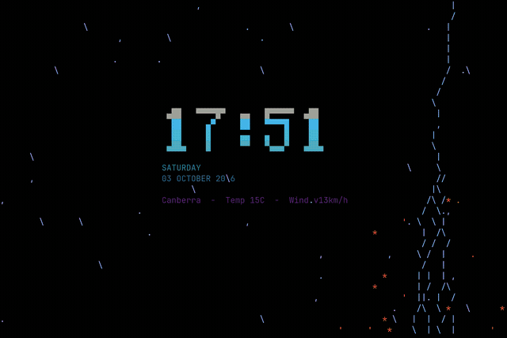

# cadence

A rotating, live ASCII display for [Omarchy](https://omarchy.dev).

Omarchy's screensaver animates one static text file — `branding/screensaver.txt`
— with a random [ttfx](https://github.com/ntno/terminaltexteffects) effect. That
is a fine default, but it is one file forever. Cadence is a fork that rotates
through a **slide list** instead: static art, images, live data, agent status and
desktop notifications, all rotating on a single global interval.

Everything is user config only. Nothing in `/usr/share/omarchy` is modified, and
your existing screensaver keeps working.

## Why it is not called `omarchy-screensaver`

`/usr/share/omarchy/bin` is **first** in `PATH`; `~/.local/bin` is much later. A
drop-in `~/.local/bin/omarchy-screensaver` therefore could never shadow
Omarchy's own command, and `omarchy-launch-screensaver` would keep launching
upstream. Cadence ships as a separate command instead, alongside the original.

## Demo

A PNG transcoded to braille cells, and the live clock slide:


A full `primary` -> `fallback` rotation on one monitor, recorded at one frame per
second and played back at 8fps. You are seeing the real screensaver sampled over
90 seconds, not an edited demo: the stats slide is live `btop` output, the green
readout is a `herdr` session, and the starfield and word art come from the
configured `ascii` and `images` slides.



## Install

```bash
git clone https://github.com/matthewhand/omarchy-screensaver-cadence
cd omarchy-screensaver-cadence
./install.sh --with-watcher --with-widget
```

Nothing needs `sudo`: everything lands in `~/.local/bin` and
`~/.config/omarchy/screensaver`.

| Flag | Adds |
|---|---|
| `--with-watcher` | a systemd user service that queues desktop notifications for the `notify` slide |
| `--with-widget` | the `matthewh.cadence` bar widget, registered in `shell.json` |

Requires `ttfx`, `jq`, `hyprctl` and `omarchy-transcode-ascii` (all present on a
normal Omarchy install). `cadence.yaml` needs PyYAML; without it cadence falls
back to the plain-text slide list. ImageMagick is optional and only used by the
banner-making helpers.

## Use

```bash
omarchy-launch-screensaver-cadence          # full screen, every monitor
omarchy-screensaver-cadence --dump          # print every slide's art and exit
```

Any key or click exits and restores the cursor. A suggested Hyprland bind:

```lua
o.bind("SUPER + SHIFT + C", "Cadence screensaver", "omarchy-launch-screensaver-cadence")
```

## Configuration

`~/.config/omarchy/screensaver/cadence.yaml`:

```yaml
interval: 20              # seconds per slide
mode: braille             # default render mode for images
width: 80                 # terminal budget
height: 26

notifications:
  enabled: true
  cycles: 6               # a notification is shown this many times, then retires

ascii:                    # one or more ASCII art files, used as-is
  - ~/.config/omarchy/branding/screensaver.txt

image:                    # one or more images
  - ~/Pictures/logo.svg

images:                   # one or more folders; drop a file in and it joins
  - ~/Pictures/cadence-slides

dynamic:                  # anything that prints ASCII to stdout
  - command: python3 ~/.config/omarchy/screensaver/stats-slide.py
```

Comments are the point, so the config is YAML and the runtime toggles live
somewhere else: `state.jsonc`, next to it. The bar widget's switches write there
rather than editing your YAML, because rewriting YAML with PyYAML would drop every
comment above. Delete `state.jsonc` to go back to what the config says.

### primary and fallback

`primary` rotates **on its own** while any of its slides can be produced. When none
can, cadence rotates `fallback` instead of showing an empty screen. So a queued
notification takes the screen when there is one, and the clock, images and word art
come back when there is not:

```yaml
primary:
  - notify

fallback:
  - command: python3 ~/.config/omarchy/screensaver/stats-slide.py
  - images: ~/Pictures/cadence-slides
  - ascii: ~/.config/omarchy/branding/screensaver.txt
```

If you use `primary` or `fallback`, the flat keys above are ignored, so the same
entry never rotates twice.

### Slide types

| In YAML | Meaning |
|---|---|
| `ascii: PATH` | ASCII art file, used as is |
| `image: PATH` | PNG or SVG transcoded by `omarchy-transcode-ascii`, cached by mtime |
| `images: DIR` | every image in `DIR`, in name order, watched live |
| `dynamic:` → `command: CMD` | stdout becomes the art, re-run every rotation |
| `notify` | newest queued desktop notification |

Any entry may add `mode: block|braille` or `enabled: false`.

Missing or exhausted slides are skipped rather than left blank, so a missing
image or an empty notification queue will not break the show. Editing
`cadence.yaml` or flipping a bar toggle takes effect within about 20 seconds,
without a restart.

### The plain-text format still works

`~/.config/omarchy/screensaver/slides` is still read when no `cadence.yaml`
exists, one directive per line:

```conf
set interval=20
set mode=braille
text ~/.config/omarchy/branding/screensaver.txt
images ~/Pictures/cadence-slides braille
exec python3 ~/.config/omarchy/screensaver/stats-slide.py
notify
```

Cadence resolves YAML into exactly this format before running, so there is one
parser and both formats behave identically.

`images` watches the directory: drop a new file in and it joins the rotation
within about 20 seconds, with no restart. Your folder is never written to --
every transcode lands in `~/.cache/omarchy/cadence/`, keyed by source path,
mtime and mode, so an unchanged image is transcoded once and then reused.

```conf
set interval=20
set notify_cycles=6

text ~/.config/omarchy/branding/screensaver.txt
images ~/Pictures/cadence-slides braille
exec python3 ~/.config/omarchy/screensaver/stats-slide.py
exec python3 ~/.config/omarchy/screensaver/herdr-slide.py
notify
```

### Per-slide colour

`ttfx` chooses its effect and gradient **when it starts** and cannot change them
mid-run, so a slide that wants a particular colour has to be started with that
colour. An `exec` slide can write `ttfx` arguments to `$CADENCE_FLAGS`:

```bash
#!/bin/bash
echo "SOME ART"
printf '%s' "--final-gradient-stops FFF75D FE650D E4002B" > "$CADENCE_FLAGS"
```

Gradients are space separated unquoted hex colours. Check what an effect accepts
with `ttfx <effect> --help`; there are around 40 effects.

### Bundled helpers

Written for this machine but generic enough to steal:

| Helper | Does |
|---|---|
| `stats-slide.py` | clock, weekday, date and `omarchy-weather-status` in the block font |
| `herdr-slide.py` | [herdr](https://herdr.dev) agent states, coloured waiting / busy / idle. Skips if herdr is not running |
| `notify-slide.py` | renders and retires queued notifications |
| `notify-watch.py` | watches the notification bus and fills that queue |
| `cadence-config.py` | resolves `cadence.yaml` into the plain-text plan |
| `cadence-ctl.py` | status and switch state for the bar widget |
| `wordfont.py` | 6x8 block font renderer shared by the helpers |

## Notifications

`Notify` on `org.freedesktop.Notifications` is a **method call**, not a signal,
so it cannot be caught with a signal subscription — it has to be eavesdropped.
`notify-watch.py` runs `dbus-monitor` and parses the argument list, which works
regardless of which daemon serves notifications (Omarchy uses quickshell, not
mako or dunst).

Each notification carries a `seen` counter and stays queued until it has been
shown `notify_cycles` times, so it lingers for several rotations instead of
flashing past once. Entries expire after an hour.

## Bar widget

`--with-widget` installs `matthewh.cadence`, which shows the configured slide count
and whether the screensaver is up, and offers:

- **Start now / Stop**
- **Notifications** toggle — writes `state.jsonc`, so your YAML and its comments
  survive
- **Edit cadence.yaml** — also on right-click of the bar icon
- **Preview slides** — `--dump` into `less -R`, so you can check art without a
  fullscreen takeover

It polls `cadence-ctl.py status` and reports `running` from the runner process
rather than from `ttfx`, because a short ttfx effect finishes and cadence rotates,
leaving gaps where the screensaver is plainly up but no `ttfx` exists.

`cadence-ctl.py` is also usable directly:

```bash
python3 ~/.config/omarchy/screensaver/cadence-ctl.py status
python3 ~/.config/omarchy/screensaver/cadence-ctl.py set notifications_enabled false
```

## Making banners

Two routes, both landing in `branding/screensaver.txt`:

**A real typeface.** Rendering with ImageMagick and transcoding gives properly
curved letterforms. Condensing the render horizontally is what buys height: at
full width `SurfaceBook` only reaches 5 rows inside the 80 column budget and is
barely legible, at 48% it reaches 10.

```bash
magick -background white -fill black -font /usr/share/fonts/liberation/LiberationSans-Bold.ttf \
  -pointsize 240 label:"SurfaceBook" -bordercolor white -border 16 -resize 48%x100%! /tmp/b.png
omarchy-transcode-ascii /tmp/b.png ~/.config/omarchy/branding/screensaver.txt -m braille -w 80 -H 26
```

**The bundled bitmap font**, no ImageMagick needed:

```bash
python3 helpers/wordfont.py SurfaceBook > ~/.config/omarchy/branding/screensaver.txt
```

Or let Omarchy do it from an image:

```bash
omarchy-branding-screensaver image    # Setup > Style > Screensaver > Set From Image
omarchy-branding-screensaver reset    # back to the Omarchy wordmark
```

## Idle

Out of the box, **idle still shows Omarchy's own screensaver**: the idle service
lives in a read-only built-in shell plugin, and `/usr/share/omarchy/bin` is first
in `PATH`, so a `~/.local/bin` shim cannot shadow it by default. To route idle
through cadence:

```bash
# ~/.local/bin/omarchy-launch-screensaver
if [[ "${OMARCHY_SCREENSAVER:-}" == "upstream" ]]; then
  omarchy_path="${OMARCHY_PATH:-/usr/share/omarchy}"
  exec "$omarchy_path/bin/omarchy-launch-screensaver" "$@"
fi
exec omarchy-launch-screensaver-cadence "$@"
```

```bash
# ~/.bash_profile -- must test for ~/.local/bin being *first*, not merely present,
# because it is already in the inherited PATH further down.
case ":$PATH:" in
  "$HOME/.local/bin:"*) ;;
  *) export PATH="$HOME/.local/bin:$PATH" ;;
esac
```

Then `omarchy-shell shell reload`. The escape hatch is
`OMARCHY_SCREENSAVER=upstream`.

## Gotchas

- **braille needs a font with braille glyphs.** JetBrains Mono Nerd Font has
  them; Liberation Mono and DejaVu Sans Mono do not. Use `block` if the
  screensaver terminal uses something else.
- **Everything is sampled down hard.** A drawing at 1600x520 becomes about
  80x26 cells (braille: 160x104 dots). Solid silhouettes survive; thin detail and
  cursive script do not.
- **80 columns by 26 rows** is the budget. Width and height bounds are enforced
  only for image transcoding; text and exec slides may produce output that
  exceeds the budget and will be shown as-is.
- **Idle still uses Omarchy's screensaver.** The idle trigger lives in a built-in
  shell plugin, so cadence is opt-in via the bind above.

## Licence

MIT. See [LICENSE](LICENSE).
